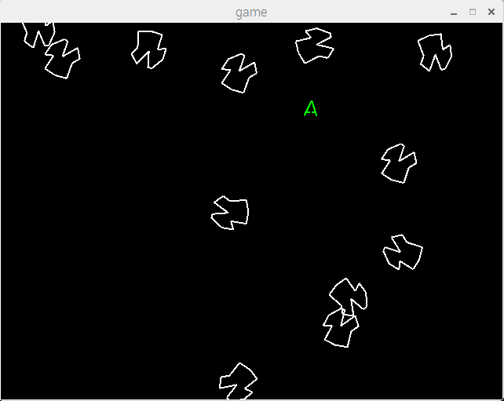

## ReadMe


Trying to finish the project of <Head First C\>

[Asteroids](https://en.wikipedia.org/wiki/Asteroids_%28video_game%29)


With the materials provided, can only achieve the effects of moving around spaceship and floating asteroids.





### How to run:


with allegro installed, compile:


```
gcc blasteroids.c asteroid.h asteroid.c utils.c utils.h spaceship.c spaceship.h -o game `pkg-config --libs allegro-5.0 allegro_primitives-5.0 allegro_color-5.0 allegro_image-5.0` -lm
```

run:

```
./game
```

### Playable games


similar repo: [blasteroids](https://github.com/r0x4h/blasteroids)

playable repo: [Allegro_Asteroids](https://github.com/blehmeh98/allegro_asteroids)

from the playable repo, should make some changes to the structs.